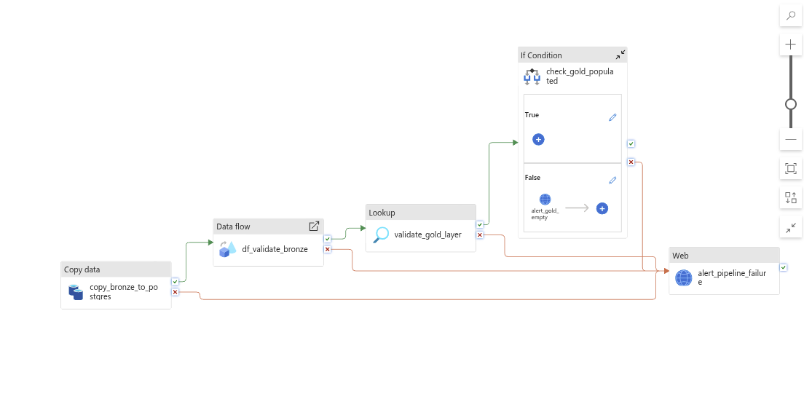
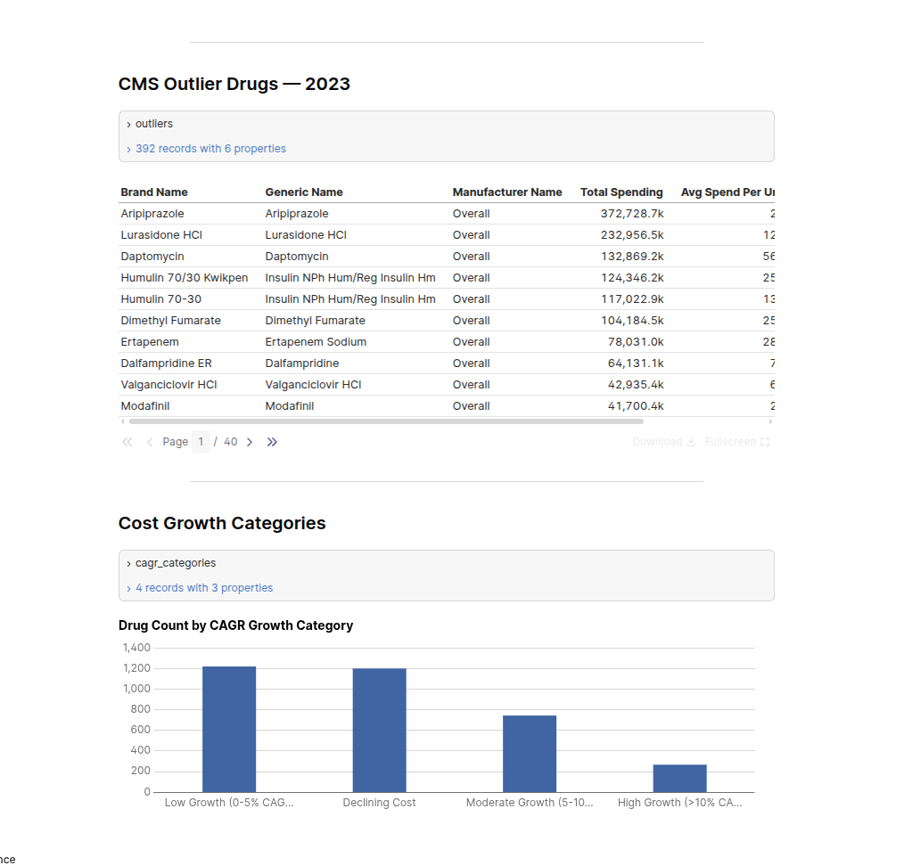

# ADF + dbt CMS Part D Drug Spending Pipeline

End-to-end data pipeline ingesting real CMS Medicare Part D drug spending data (14,309 drugs, 2019–2023) from Azure Blob Storage through Azure Data Factory into a dbt-transformed Neon PostgreSQL warehouse, with CI/CD via GitHub Actions and an Evidence.dev analytics dashboard.


---

## Architecture
Azure Blob Storage (Bronze)
→ Azure Data Factory
→ Copy Activity (idempotent load)
→ Data Flow (schema validation + Assert transformations)
→ Lookup Activity (Gold layer health check)
→ If Condition (row count validation)
→ Neon PostgreSQL
bronze.cms_partd_raw        (ADF ingestion target)
silver.stg_cms_partd        (dbt staging — renamed, typed, cleaned)
silver.int_partd_unpivoted  (dbt intermediate — wide to long unpivot)
gold.fct_drug_spending      (dbt fact — 60,478 rows)
gold.fct_drug_cagr          (dbt fact — CAGR analysis)
gold.dim_drugs              (dbt dimension — 11,477 unique drugs)
silver.snp_drug_spending    (dbt SCD Type 2 snapshot)
→ Evidence.dev Dashboard



---

## Dataset

**CMS Medicare Part D Drug Spending by Brand & Manufacturer**
Release Year 2025, Payment Year 2023 — public CMS data

- 14,309 rows | 5.2MB | 46 columns
- 5 years of spending metrics (2019–2023)
- Covers every brand-name and generic drug reimbursed under Medicare Part D
- Metrics: total spending, claims, beneficiaries, unit cost, CAGR, outlier flags

---

## Stack

| Layer | Technology |
|---|---|
| Orchestration | Azure Data Factory (Copy, Data Flow, Lookup, If Condition activities) |
| Raw Storage | Azure Blob Storage |
| Transformation | dbt Core (dbt-postgres adapter) |
| Warehouse | Neon PostgreSQL (Bronze / Silver / Gold schemas) |
| Data Quality | dbt-expectations (source + model tests), ADF Assert transformations |
| SCD Type 2 | dbt snapshot on fct_drug_spending |
| CI/CD | GitHub Actions (JSON validation, dbt CI, ADF deploy) |
| Dashboard | Evidence.dev |

---

## Key Transformations

**Wide-to-long unpivot**
The raw CMS file delivers 46 columns representing 5 years of metrics horizontally per drug. The dbt intermediate model uses a Jinja for loop to generate UNION ALL blocks for each year, transforming the wide schema into a long time-series format — one row per drug + manufacturer + year. This makes all downstream aggregations and time-series analysis straightforward SQL.

**CAGR categorization**
`fct_drug_cagr` buckets each drug's 5-year compound annual growth rate into tiers: High Growth (>10% CAGR), Moderate Growth (5–10%), Low Growth (0–5%), Declining Cost, and New Drug (No History). This surfaces formulary cost management insights directly from CMS public data.

**Surrogate keys**
`dbt_utils.generate_surrogate_key` on `brand_name + generic_name + manufacturer_name + spend_year` produces unique row identifiers for the fact table and snapshot, resolving a real data challenge: CMS uses the same brand name for multiple generic variants (e.g. "Insulin Syringe" covers 5 different generic formulations).

**SCD Type 2**
dbt snapshot tracks changes in total spending, unit cost, and outlier flag across pipeline runs. When CMS revises historical data in a new release, the snapshot closes the old record with a `dbt_valid_to` timestamp and opens a new one — enabling point-in-time historical accuracy.

---

## Pipeline Design Decisions

**Idempotency**
The Copy Activity runs a pre-copy DELETE against `bronze.cms_partd_raw` filtering on the source filename before each load. Re-running the same file on retry or backfill always produces the same result with no duplicates.

**Annual trigger**
CMS publishes Part D drug spending data once per year. The pipeline uses an annual schedule trigger that matches the actual data release cadence — more architecturally honest than an arbitrary daily schedule on a static file. A tumbling window trigger is also configured for backfill capability.

**CI without cloud credentials**
The dbt CI workflow runs `dbt compile`, `dbt run`, and `dbt test` against DuckDB in GitHub Actions — no Neon credentials required, no cloud access needed. Same models, same tests, different adapter. This is a standard pattern on mature data teams.

**Loose coupling**
ADF handles ingestion and orchestration of the raw layer. dbt handles transformation. The Lookup Activity validates the Gold layer is healthy before marking the pipeline successful. Each layer is independently replaceable.

---

## Key Findings

Running this pipeline against real CMS data surfaces several analytically interesting patterns:

- **Eliquis (Apixaban)** is the single largest Medicare Part D drug at $18.3B in 2023 spending, with a 6.9% 5-year unit cost CAGR
- **Ozempic (Semaglutide)** shows a counterintuitive pattern — unit cost CAGR is negative (-4.2%) despite $9.2B total spend, driven by volume growth outpacing unit price declines
- **Magnesium Chloride** has the highest CAGR at 488% — a generic IV electrolyte with minimal total spend, illustrating drug shortage-driven pricing spikes on low-volume drugs
- **Lagevrio (Molnupiravir)** at 205% CAGR reflects rapid COVID antiviral adoption into Medicare Part D post-pandemic



---

## CI/CD Workflows

| Workflow | Trigger | What it does |
|---|---|---|
| `adf_validate.yml` | PR touching ADF files | Validates all pipeline JSON is well-formed and has required properties |
| `dbt_ci.yml` | PR touching dbt models | Runs dbt compile, run, and test against DuckDB — no cloud credentials needed |
| `adf_deploy.yml` | Push to main touching ADF files | Deploys updated ADF ARM template via Azure CLI |

---

## Running Locally

**Prerequisites:** Python 3.10+, dbt-postgres, Node.js 18+, Azure CLI

```bash
# Clone the repo
git clone git@github.com:anZro/adf-cms-claims-pipeline.git
cd adf-cms-claims-pipeline

# Set up dbt
cd dbt/cms_partd_dbt
pip install dbt-postgres
dbt deps
# Configure ~/.dbt/profiles.yml with your Neon connection
dbt run
dbt test

# Set up Evidence dashboard
cd ../../cms-partd-dashboard
npm install
npm run sources
npm run dev
```

---

## Cleanup

```bash
# Delete all Azure resources
# Portal → Resource Groups → rg-cms-partd-pipeline → Delete resource group
```

Neon free tier has no expiration. All pipeline JSON, dbt models, and CI/CD workflows live in GitHub.

---

## Related Project

[cms-claims-pipeline](https://github.com/anZro/cms-claims-pipeline) — DuckDB + dbt + Apache Airflow pipeline joining CMS Part D drug spending with provider utilization data (3.1GB) for cross-dimensional healthcare analytics.
